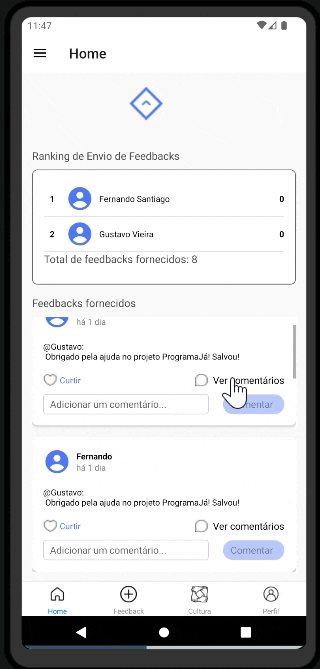
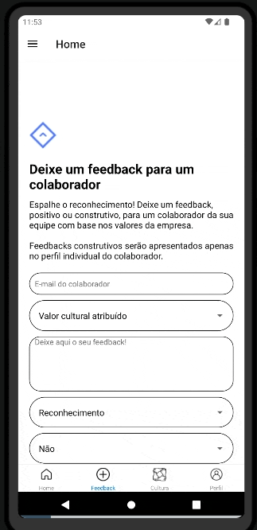
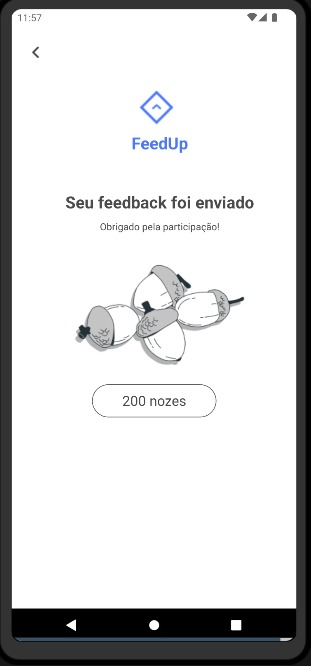
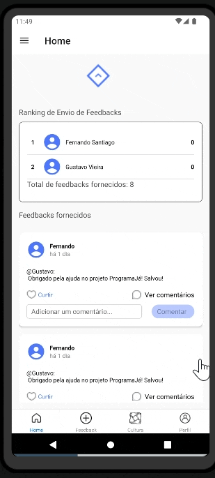
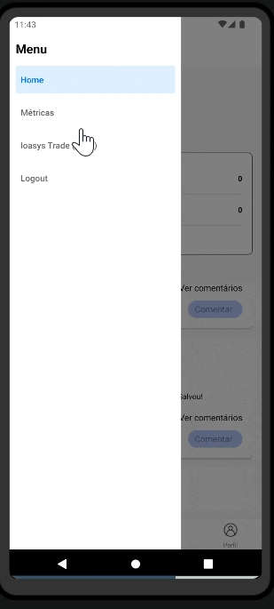

  

<h1 align="center">
  <b>FeedUP</b>
</h1>

  <i>“Reconhecimento é a melhor forma de estimular alguém” - Mário Sérgio Cortella</i>

## 🦾 DESAFIO 
**Proposta para a 2ª fase da 5ª edição do CAMP ioasys:** Construir uma aplicação com base em pelo menos um dos valores de cultura da organização escolhida.

## ⚛️ PROJETO  

O **FeedUp** é uma **comunidade para trocas de feedbacks** entre colaboradores de uma empresa, com objetivos de:
- Aumentar do engajamento dos funcionários;
- Aumentar a produtividade;
- Melhorar taxas de retenção da empresa.

O FeedUp revela percepções no trabalho que não poderiam ser encontradas em nenhum outro lugar de forma rápida.

**Este projeto implementa um aplicativo mobile para o FeedUp**. 

## 📷 LAYOUT  
[Link para Figma do aplicativo](https://www.figma.com/design/RbgVwzwaBggNhu0Uzbmc8O/FeedUp?node-id=130%3A2805&t=giYM9WZ9586bGSNY-1)

## 🛠️ TECNOLOGIAS 
- **React Native (v51.0.0):** Framework para desenvolvimento de aplicativos mobile em Android, iOS, entre outros.
- **IDE:** Código implementado com Android Studio.
- **Imagem de dispositivo Android emulado** - Android Pixel 4 5.7 1080x2280 / Android Vanilla Icecream API arm64-v8a
- **Bibliotecas principais:**
  - [React Native](https://www.npmjs.com/package/react-native)
  - React Navigation ([native](https://www.npmjs.com/package/@react-navigation/native), [native-stack](https://www.npmjs.com/package/@react-navigation/native-stack), [drawer](https://www.npmjs.com/package/react-native-drawer), [bottom-tabs](https://www.npmjs.com/package/@react-navigation/bottom-tabs))
  - [React Native Picker](https://www.npmjs.com/package/react-native-picker-select)
  - [React Reanimated](https://www.npmjs.com/package/react-native-reanimated)
  - [React Native Swipe Gestures](https://www.npmjs.com/package/react-native-swipe-gestures)
  - [React Native Gesture Handler](https://www.npmjs.com/package/react-native-gesture-handler)
  - [React Native SVG Charts](https://www.npmjs.com/package/react-native-svg-charts)
  - [React Native Vector Icons](https://www.npmjs.com/package/@react-native-vector-icons/ionicons)
  - [Axios](https://www.npmjs.com/package/react-native-axios)
  - Demais bibliotecas detalhadas no [`package.json`](https://github.com/FeedUp-Hub/FeedUp-Mobile/blob/main/package.json)

## 📐 ARQUITETURA  
O aplicativo foi construído utilizando uma arquitetura componentizada conforme estrutura abaixo:
- _src_
  - _assets_
    - _fonts_
    - _Images_
  - _components_ (arquivos que implementam as telas dos recursos gerais do aplicativo).
  - _config_ (serviços para integração com APIs)
  - _layouts_ (implementações das telas do aplicativo).
  - _routes_ (implementações as rotas de navegação do menu fixo no rodapé (bottom menu) do projeto e o menu lateral (drawer menu)).
  - _Styles_
    - _fonts_
  - _App.jsx_ (implementação do estado inicial do aplicativo, direcionando as rotas de navegações (routes)).
  - _Package.json_ (biblioteas e dependências)

## 📋 RECURSOS  
- **Autenticação**
  - Tela de login (com mudança de status no caso de usuário com senha em cache)
  - Cadastro (recurso não ativado, mas existente no código de acordo com necessidade da empresa)
- **Onboarding**
  - Telas com informações gerais do aplicativo
- **Navegação**
  - Menu no rodapé para acesso as páginas principais
  - Menu drawer na lateral para acesso a páginas secundárias
- **Feedbacks**
  - Tela inicial com listagem de todos os feedbacks recebidos pelos colaboradores, ordenada
  - Opções de curtir comentário, listar comentários e adicionar comentários a um feedback listado
  - Tela para inserção de novo feedback a colaborador, informando valor atrelado
- **Usuário**
  - Tela de perfil do usuário
- **Dashboard**
  - Tela com gráficos de indicadores gerais do aplicativo
- **Outras**
  - Tela com listagem de valores da empresa
  - Tela para troca de Nozes por produtos (em breve)

## 🖼️ TELAS  
- **Splash + Login:** Telas de carregamento inicial do aplicativo e carregamento da tela de login.

  

- **Autenticação e Onboarding:** Autenticação (feita via integração com API do projeto) e direcionamento onboarding contendo 3 telas com opção de swipe para esquerda e direita e finalizando com página de Termos de Uso com necessidade do usuário concordar.

  

- **Home:** Tela com lista de todos os FeedUps (feedbacks) recebidos pelos colaboradores, incluindo recurso para curtir feedbacks e fazer comentários.

- **Feedback + Obrigado:** Tela para adicionar um novo FeedUp ao colaborador, onde o usuário pode além de escrever um feedback selecionar a qual valor cultural está associado e se a mensagem será postada anonimamente. Ao finalizar o usuário é direcionado a tela de agradecimento.
  

- **Cultura:** Tela com a listagem de todos os valores da companhia.

- **Profile:** Tela com o perfil do usuário logado, mostrando os feedbacks recebidos por ele.

- **Métricas:** O usuário poderá visualizar indicadores gerais dos feedbacks enviados.

## 🚀 EXECUTANDO O PROJETO  
Para executar o aplicativo localmente é necessário seguir os passos abaixo:

`1. Realize um clone desse repositório na sua máquina local, garantindo que ele seja movido para um diretório próprio.`

    git clone https://github.com/FeedUp-Hub/FeedUp-Mobile.git

`2. Abrir IDE com recurso para execução de códigos React Native e acessar o diretório.`
    
    cd FeedUpMobile

`3. Instale e start uma imagem de dispositivo móvel (utilizada Pixel 4…).`

`4. Ative o emulador de dispositivo.`

`5. Execute os comandos abaixo no diretório raíz do seu projeto, na ordem:`
    
    npm install
    
    npm run android
    
    npm start –reset-cache
    
`6. O aplicativo será exibido na tela do emulador`
    
`7. Teste para envio de novo feedback:`

    Enviar para usuário 'Fernando'.
    

## ✅ TESTES  
- [Testes realizados no projeto de Quality Assurance](https://github.com/FeedUp-Hub/FeedUp-QA)

Além dos testes realizados pelo QA, bloqueios foram adicionados no aplicativo para que algumas ações não pudessem ser realizadas:

- **Bloqueio Login:** O usuário recebe uma mensagem de erro caso não preencha corretamente o formulário de autenticação.

- **Bloqueio Novo Feedback:** O usuário recebe uma mensagem de erro caso não preencha corretamente o formulário de novo feedback.

Comentários em branco: Comentários enviados em branco não são adicionados, essa tratativa foi implementada dentro da função handleComment() em FeedScreen.jsx.

## 🤝  EQUIPE 
- **Desenvolvedores**: Fernando Santiago (**Mobile**), Gustavo Vieira (Back-end), Bernardo Alvim (Front-end)
- **Testes**: Gabriel Resende (QA)
- **Agilidade**: Isabella Lima
- **Design**: Giovana Willberg 
- **Dados**: Paula Souza

_**Mentores Mobile / React-Native**: Fabiano Vilela, Jonas Bastos, Mauricio Vieira, entre outros_

## 🧑‍💻 DESENVOLVEDOR  
Fenando Santiago ([Linkedin](https://www.linkedin.com/in/fernando-santiago/)) / Contato: fernando.santiago770@gmail.com

  

